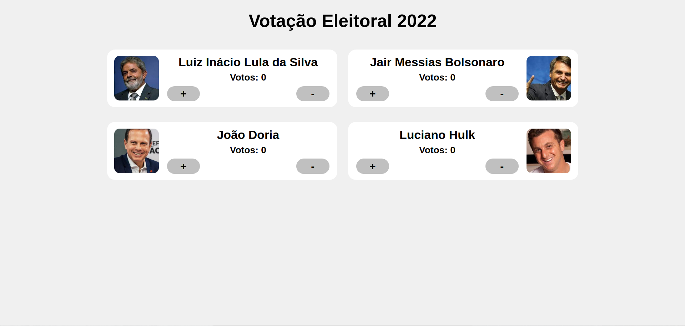

# bootcamp-react-bandtec
Bootcamp de React da Bandtec

## Exemplo Aplicação

### Aula 1 - Aplicação de Eleição Presidêncial 2022
<br>
<p align="center">
  
</p>
<br>

### Aula 2 - Landing Page Site MusicBox
<br>
<p align="center">
  
</p>

## Instalação e Iniciar

### Aula 1

``` npm i -g live-server ```

``` cd Aula01/ ```

``` live-server ```

### Aula 2

``` cd Aula02/ ```

``` yarn ```

``` yarn start ```

## Desenvolvedor

* Felipe Azevedo

